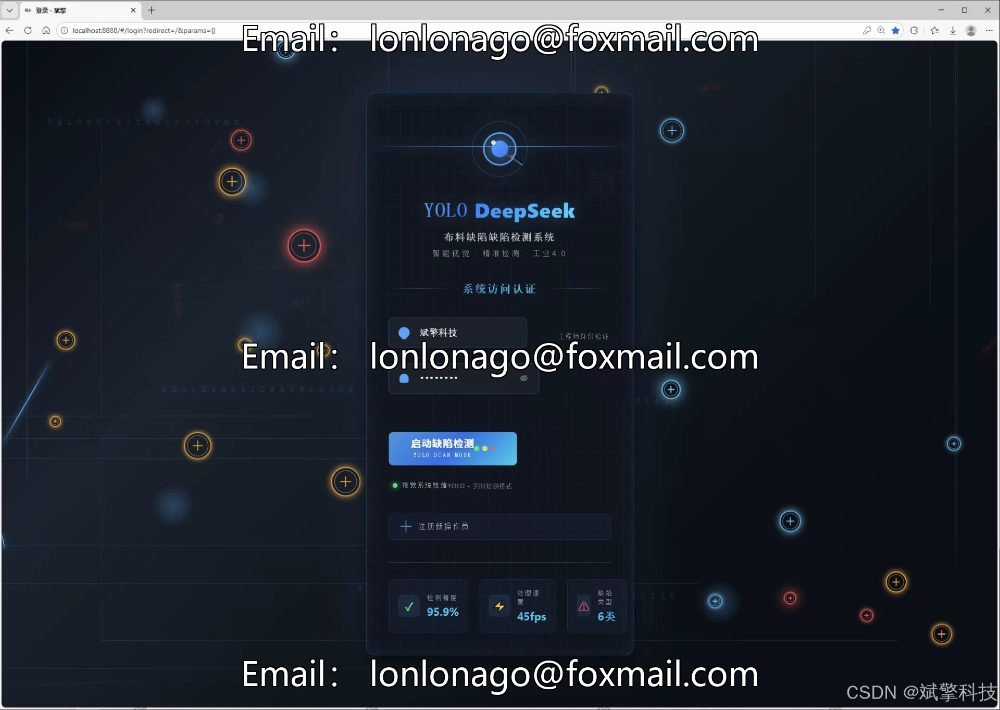
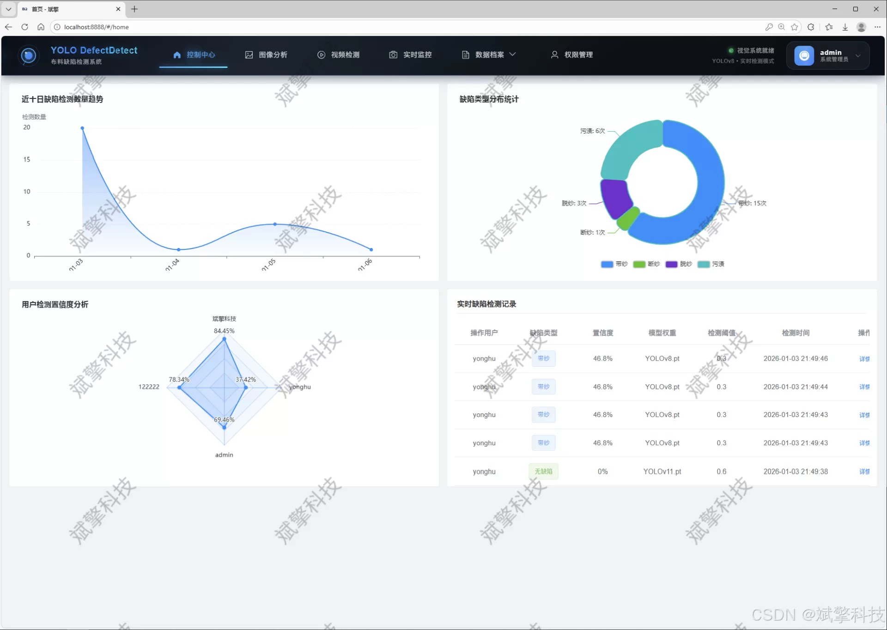
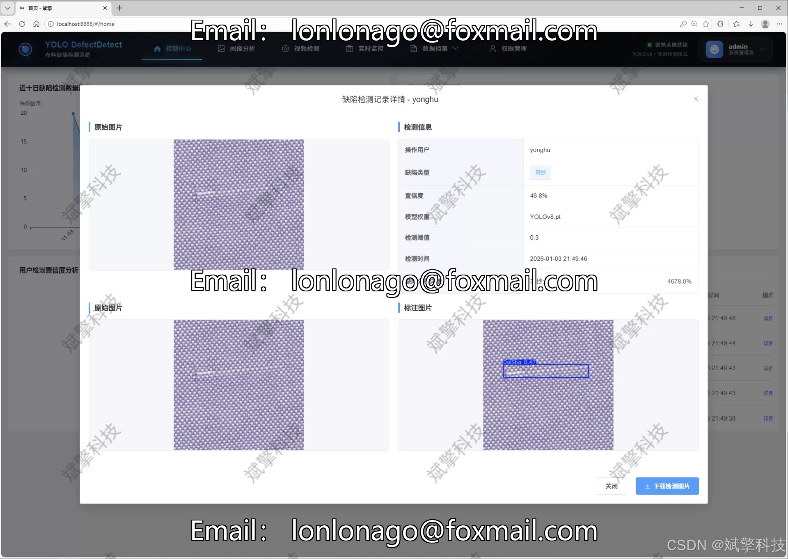
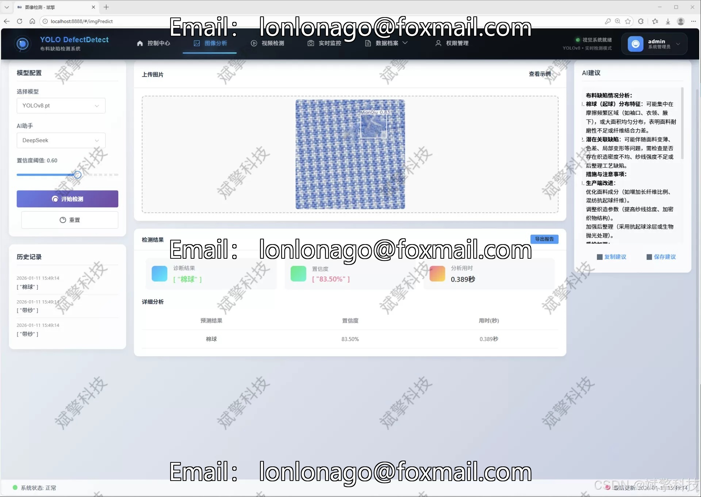
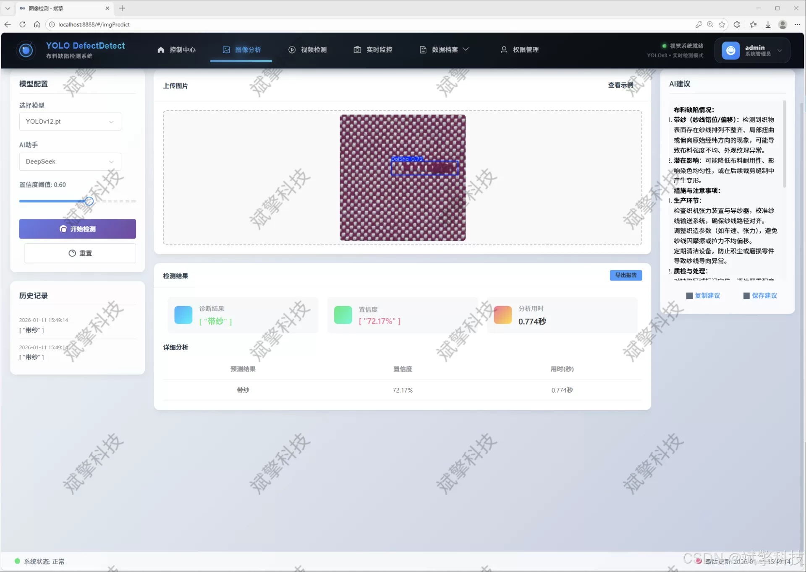
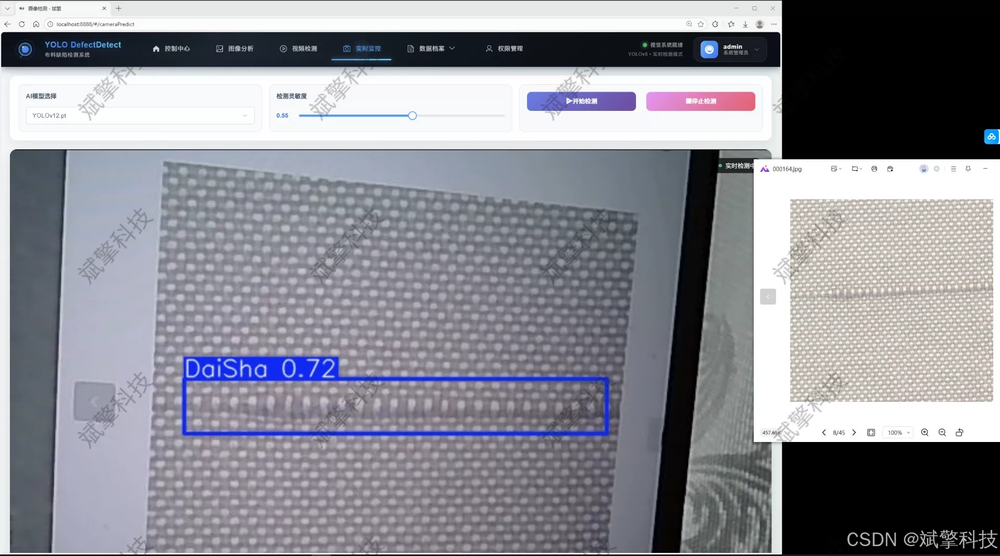
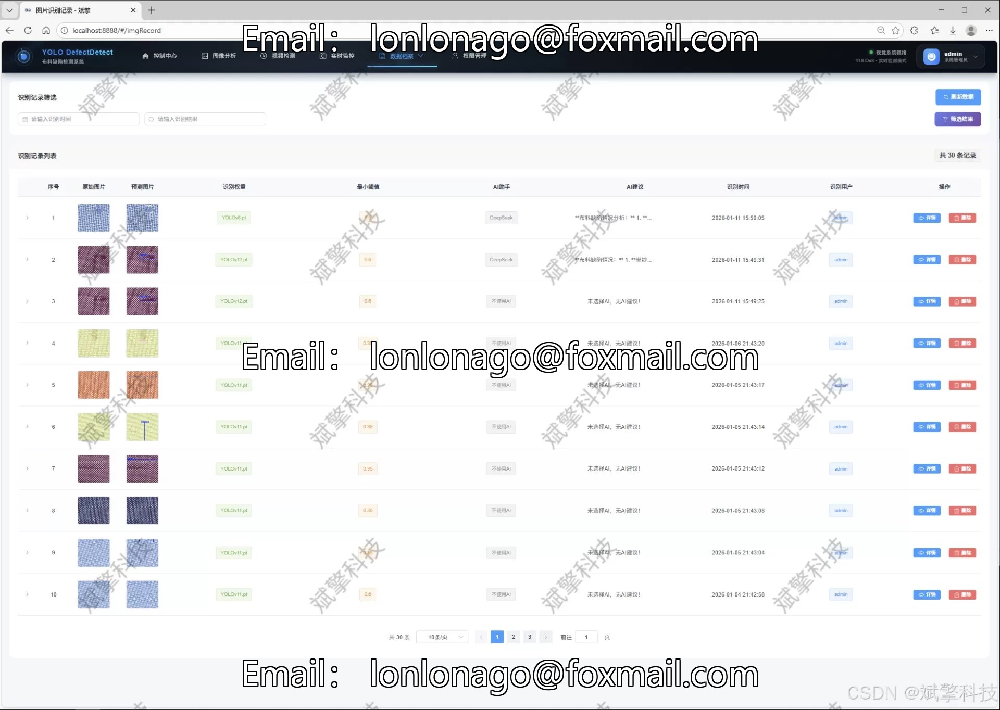
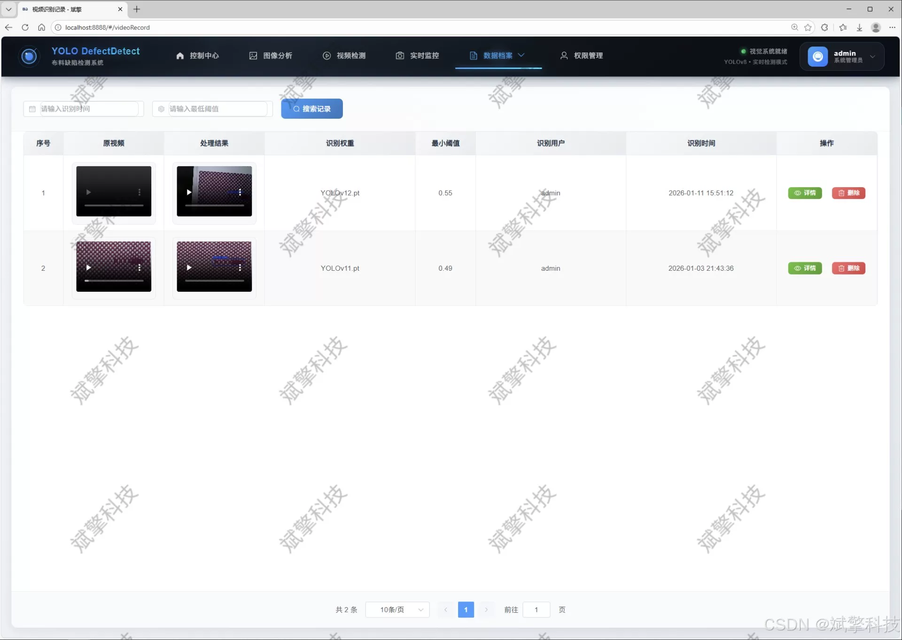
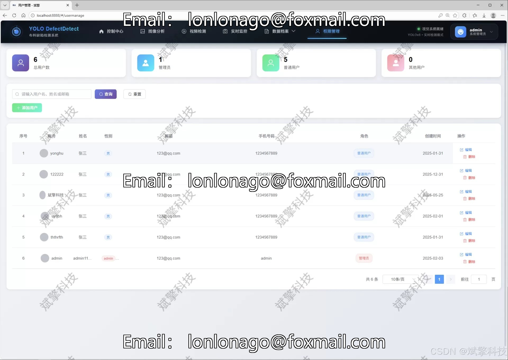

# Based on YOLO deep learning and the large models of Qianwen and DeepSeek for fabric defect detection

## Body

Based on YOLO deep learning and the big models of Qianwen, DeepSeek cloth defect detection system (DeepSeek intelligent analysis + web interface + front-end separation + YOLO data + YOLOv8/YOLOv10/YOLOv11/YOLOv12)

This project proposes and implements an intelligent and high-precision cloth defect detection system based on deep learning and Web technology. The core of the system combines the cutting-edge target detection algorithm YOLOv8, YOLOv10, YOLOv11, and YOLOv12 to build a high-performance cloth defect recognition model. The backend is built using the SpringBoot framework to establish a stable and scalable RESTful API service. The front end is constructed through modern Web technologies to create an interactive and functional user interface. The overall architecture follows the principle of front-end separation, ensuring the maintainability and high concurrency performance of the system. In addition, the system innovatively integrates the intelligence analysis capabilities of the DeepSeek large language model, providing semantic interpretations and production decision suggestions for the detection results. The system supports the precise recognition and classification of six common defects in the cloth production process (threading, breakage, cotton ball, tear, yarn untwisting, stain), and provides a complete solution for image, video streams, and real-time camera detection. All detection records are persistently stored in the MySQL database. The system also comes with a complete user permission management system and personal center module, ensuring data security and compliance with operations. Experiments show that the system achieves excellent detection accuracy and real-time performance on a dataset (including 1650 training images and 467 validation images), effectively improving the automation and intelligence level of textile production quality control.

Functional modules

✅ User login registration: Support password verification, saved to MySQL database.

✅ Support four YOLO models switching, YOLOv8, YOLOv10, YOLOv11, YOLOv12.

✅ Information visualization, data visualization.

✅ Image detection support AI analysis function, deepseek and Qianwen.

✅ Support image detection, video detection, and real-time camera detection, detection results saved to MySQL database.

✅ Image recognition record management, video recognition record management, and camera recognition record management.

✅ User management module, administrator can add, delete, modify, and view users.

✅ Personal center, can modify their own information, password name profile picture and so on.

## Images

## Payment

Here is a pay link on Stripe ( https://buy.stripe.com/3cs8yP7sY87d0vu9AB ). Please contact me lonlonago@foxmail.com after funding $89, and I will send you a complete data files , thank you!

